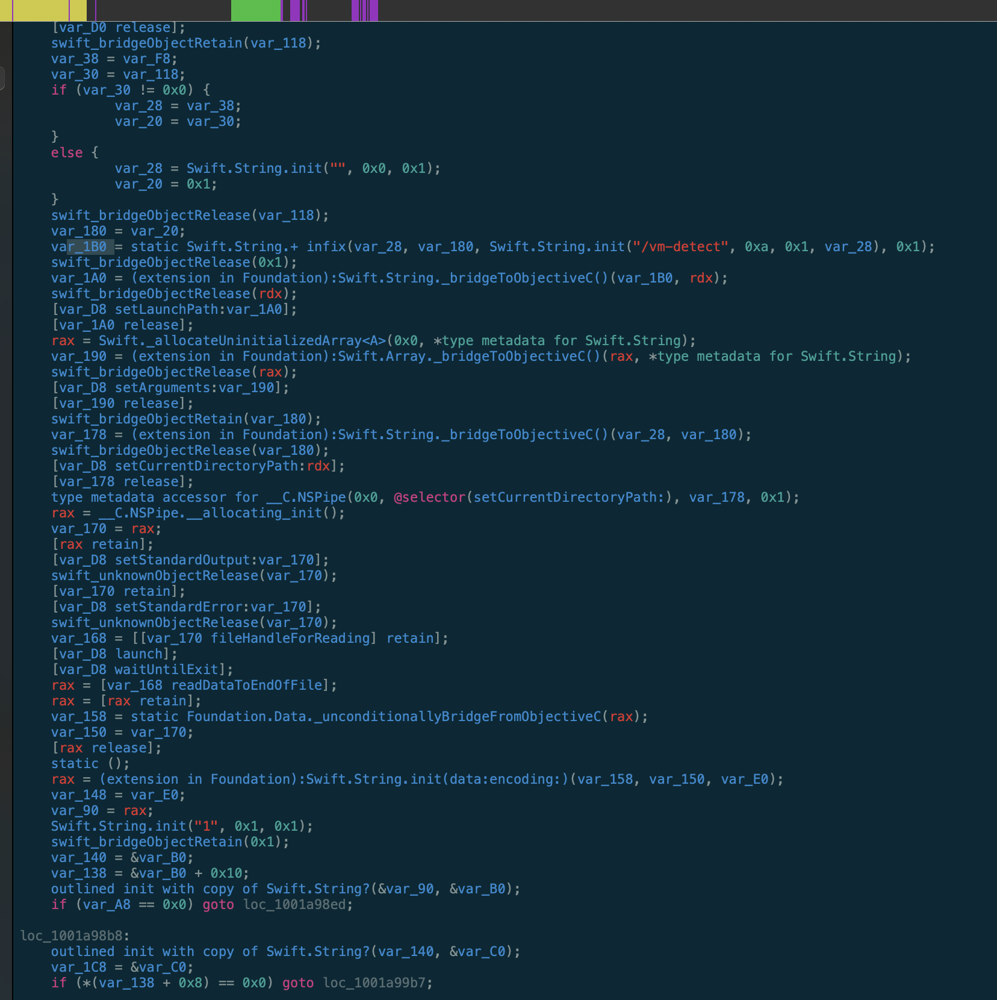
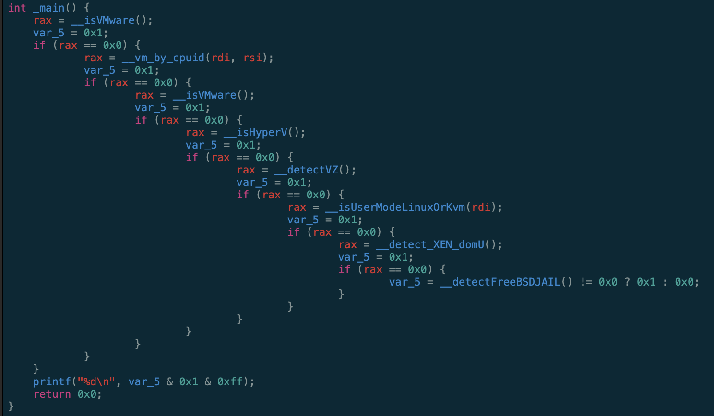
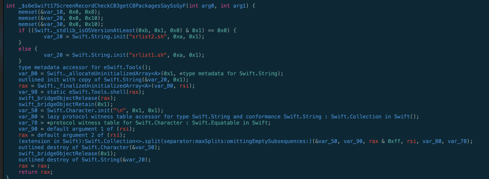
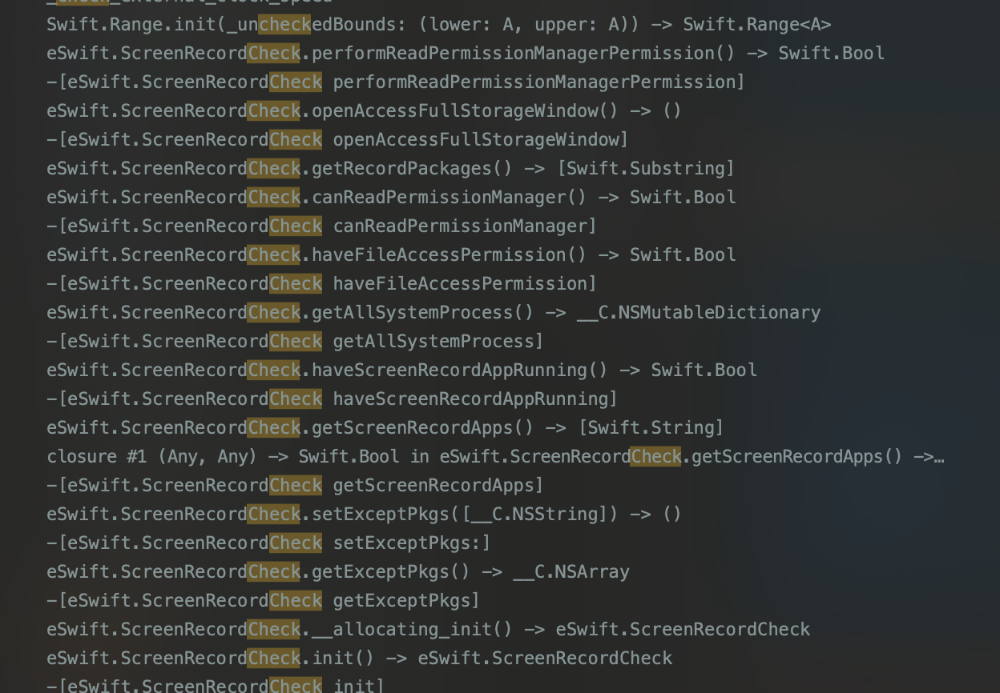
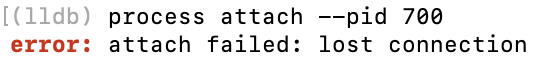
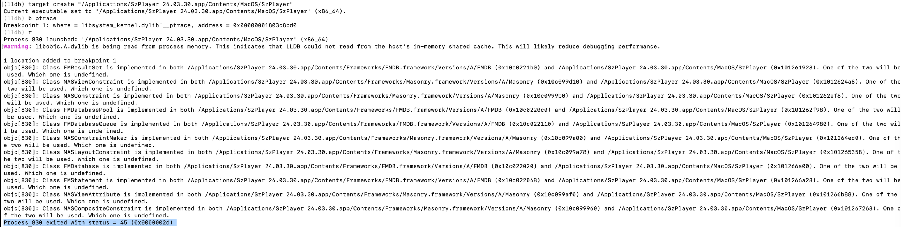
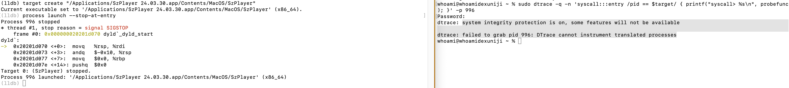

# "SZ"App检测绕过

## 静态分析

1. 虚拟机检测
    
Resources/vm-detect

 

最简单的方式就是替换一个 binary 打印 0。

2 截图进程检测

先从NSRunningApplication 获取正在运行的进程，再从 tcc 中获取哪些 app 获取到屏幕共享权限的：



`srlist1.sh` & `srlist2.sh` 内容：

```bash
sqlite3 '/Library/Application Support/com.apple.TCC/TCC.db' "select client from access WHERE service like '%ScreenCapture' and auth_value = 2 or auth_value = 3"
sqlite3 '/Library/Application Support/com.apple.TCC/TCC.db' "select client from access WHERE service like '%ScreenCapture' and allowed = 1"
```

swift 方法：




在这里把 haveScreenRecordAppRunning() → Swift.Bool 绕一下

hook 思路好几种：

1. 修改 `srlist1.sh & srlist2.sh` 内容
2. oc 是比较好hook的
    1. hook NSRunningApplication
    2. hook haveScreenRecordAppRunning 调用的上层是个 objc 方法
3. hook swift 方法：https://www.mbo42.com/2018/04/01/hooking-swift-methods/


## 动态分析

应用有反调试：



也没 `ptrace` 符号：



可能是 `asm syscall (0x200001A)`，尝试用 dtrace 抓一下系统调用：

```bash
$ lldb  "/Applications/Szxxxx.app/Contents/MacOS/Szxxxx"
(lldb) process launch --stop-at-entry

...
sudo dtrace -q -n 'syscall:::entry /pid == $target/ { printf("syscall> %s\n", probefunc); }' -p $PID
```



damn! dtrace 不支持转义的进程（这个App 是x86_64 我的电脑是m1）

---
继续lldb，main断点没跑到，我以为是第三方库的加载，挨个断点也没看到。然后把主 macho 函数全断了，就找到了：

```bash
$lldb  "/Applications/Szxxxx.app/Contents/MacOS/Szxxxx"
(lldb) b -r . -s Szxxxx
* thread #1, queue = 'com.apple.main-thread', stop reason = breakpoint 1.4791
    frame #0: 0x000000010014b4b0 Szxxxx`+[Foo load]
Szxxxx`+[Foo load]:
->  0x10014b4b0 <+0>: pushq  %rbp
    0x10014b4b1 <+1>: movq   %rsp, %rbp
    0x10014b4b4 <+4>: movq   %rdi, -0x8(%rbp)
    0x10014b4b8 <+8>: movq   %rsi, -0x10(%rbp)
Target 0: (Szxxxx) stopped.
```

打开反汇编软件 +[Foo load] nop 掉。