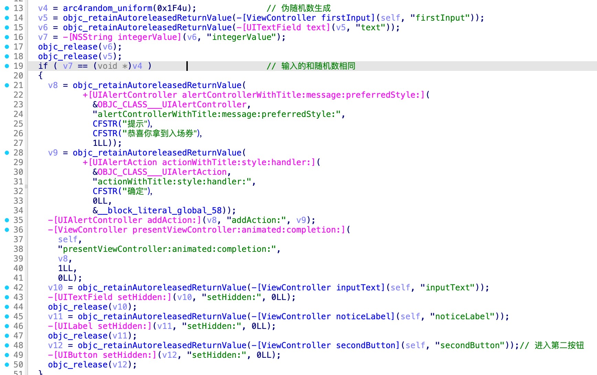
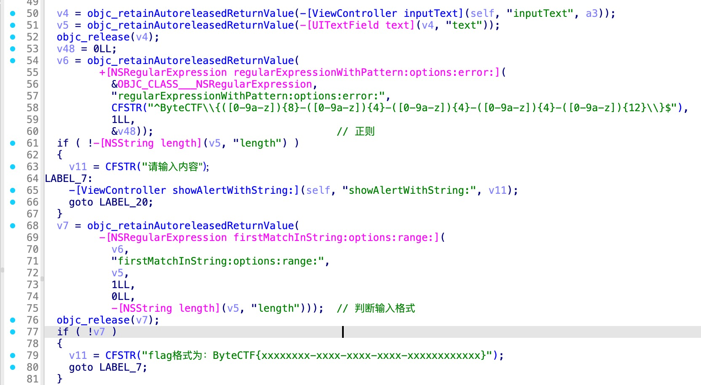
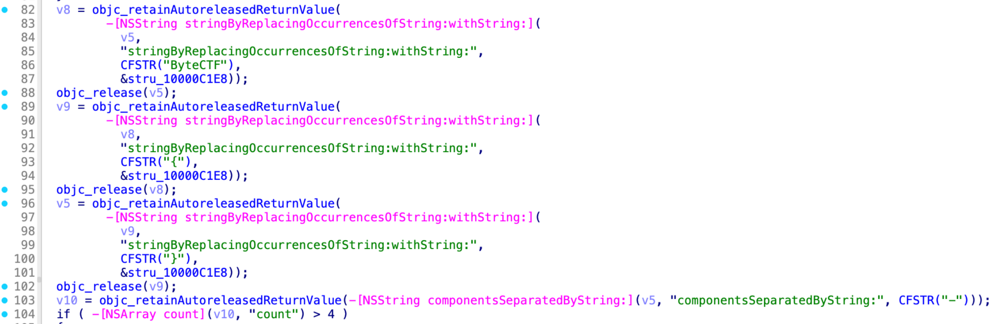
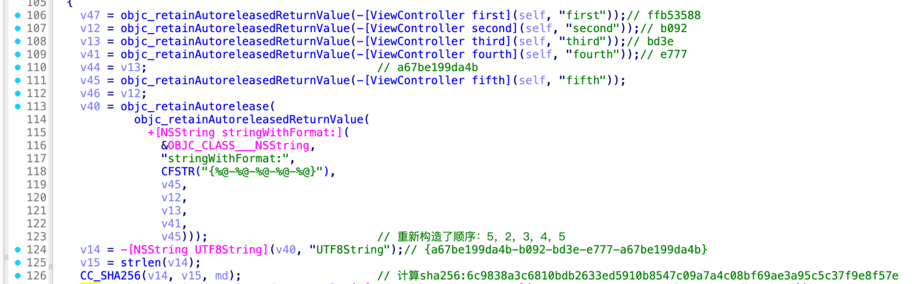
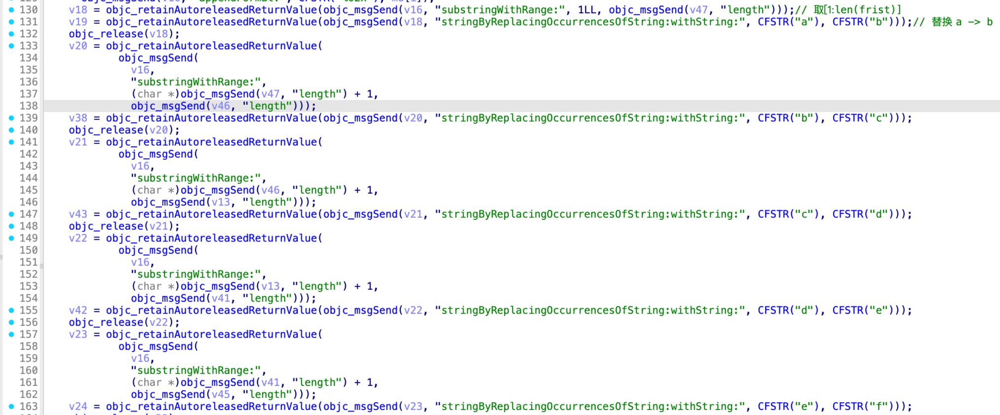
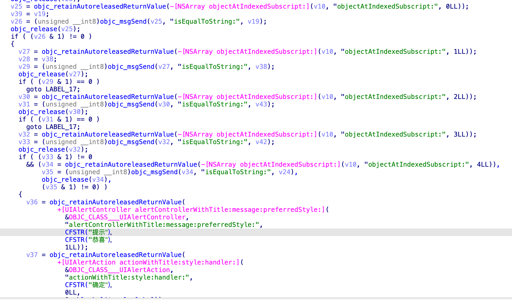

# 分析

1. frist button



2. second button

    1. 判断输入格式

        
    
        
    
    2. 拼接字符串
        
        使用初始化的数据拼了一个flag格式的字符串，然后算了个SHA256：
        

        根据sha256去拼接各个段：
        

        最后去对比：
        

# Poc
```python
sha256 = '6c9838a3c6810bdb2633ed5910b8547c09a7a4c08bf69ae3a95c5c37f9e8f57e'
data = []
data.append(sha256[1:9].replace('a', 'b'))
data.append(sha256[9:9+4].replace('b', 'c'))
data.append(sha256[5:5+4].replace('c', 'd'))
data.append(sha256[5:5+4].replace('d', 'e'))
data.append(sha256[5:5+12].replace('e', 'f'))

print("ByteCTF{%s}" % '-'.join(data))

# ByteCTF{c9838b3c-6810-8a3d-8a3c-8a3c6810bdb2}
```