# HZRat
- Sample: https://github.com/objective-see/Malware/blob/main/HZ_RAT.zip
- Frist writeup: https://securelist.com/hz-rat-attacks-wechat-and-dingtalk/113513/

## Let's analyze the sample again

### Extract the pkg file

- `SuspiciousPackage` cannot extract
> "the package installs files but doesn't declare them"

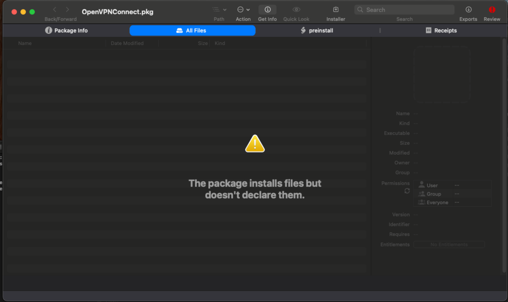

- `% pkgutil --expand OpenVPNConnect.pkg out`

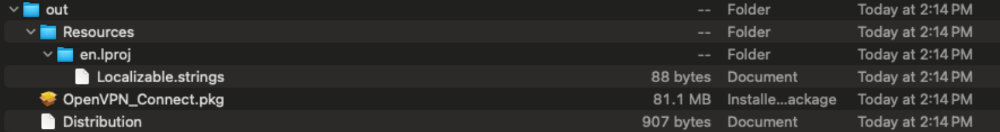

- List `OpenVPN_Connect.pkg/`

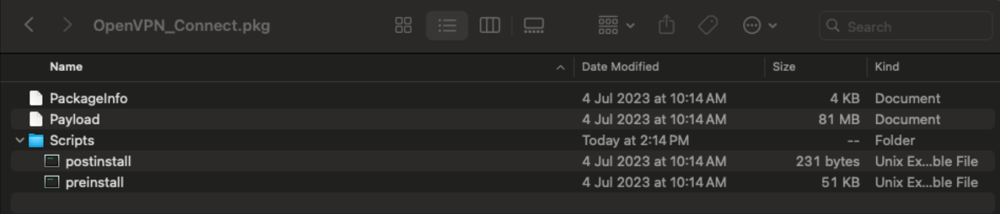

- Scripts
    - `pretinstall`: a macho file
    - `postinstall`: set permissions for OpenVPN Connect.app
    

- Extract payload -> `/Applications/OpenVPN Connect.app`:
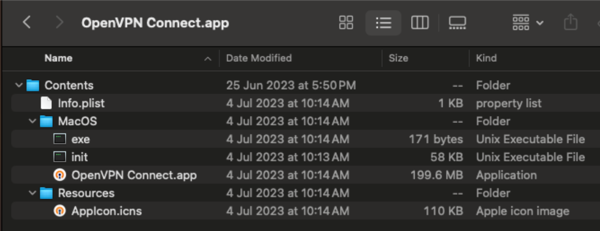

    - `OpenVPN Connect.app`: It's a legal App.
    - `exe`: Execute the `init` malicious file in the background and open "OpenVPN Connect.app"
    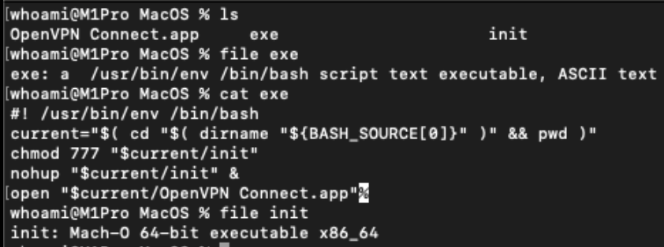
    - `init`: a macho file

### Reversing Analysis

#### `pretinstall`

- `execvp` is executed at startup
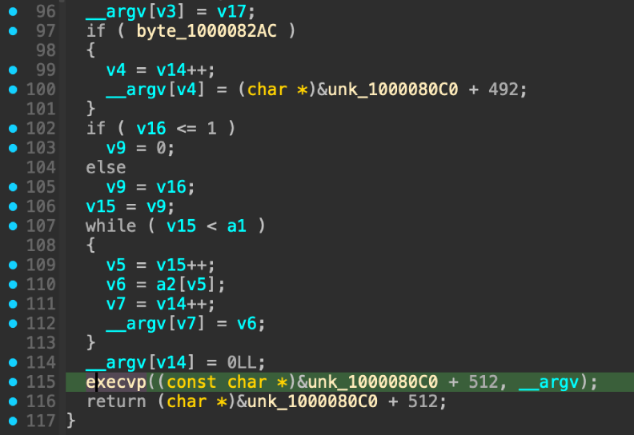

- Dynamic analysis to obtain `execvp` parameters:
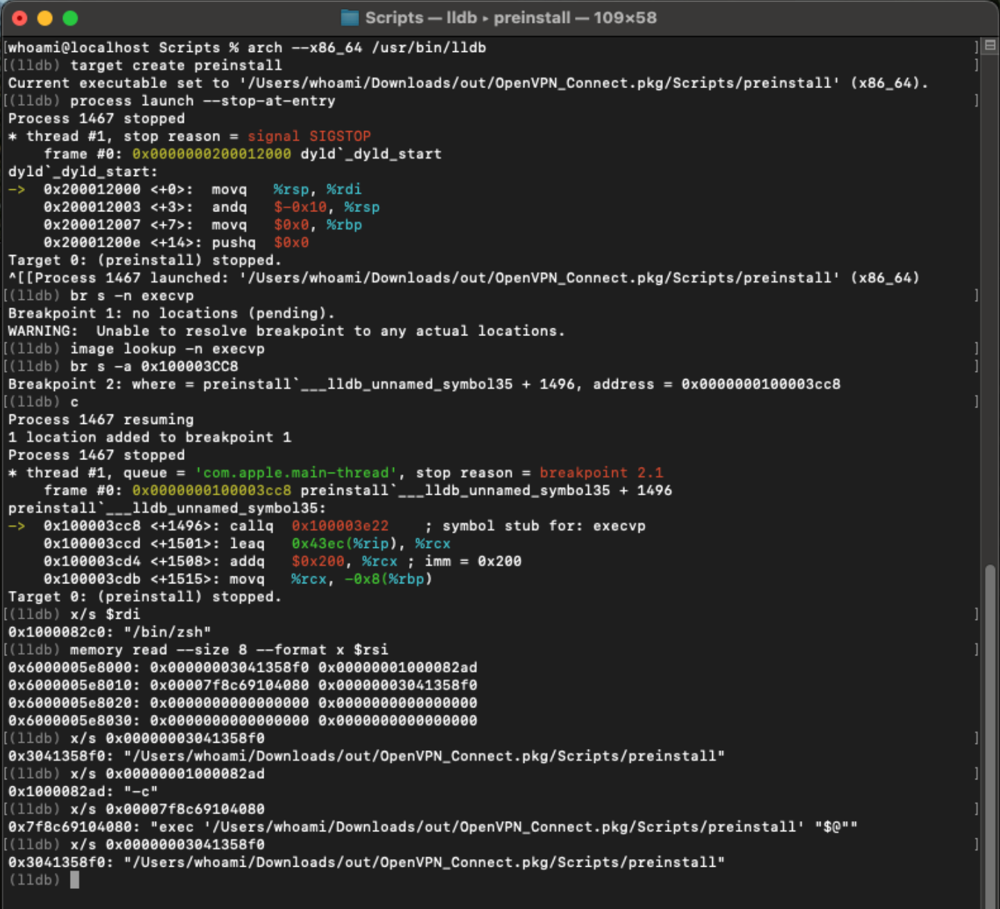
    Looks like it did nothing.

#### `init`

- It will connect to the C&C server ip at startup
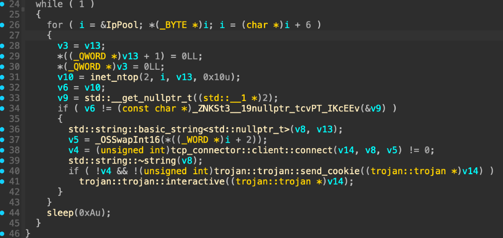

- C&C Server IP
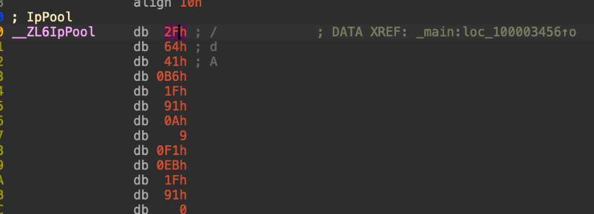

    Here, the port: 0x1f91 => 8081
    - 47.100.65.182:8081
    - 10.9.241.235:8081

- Send Cookie
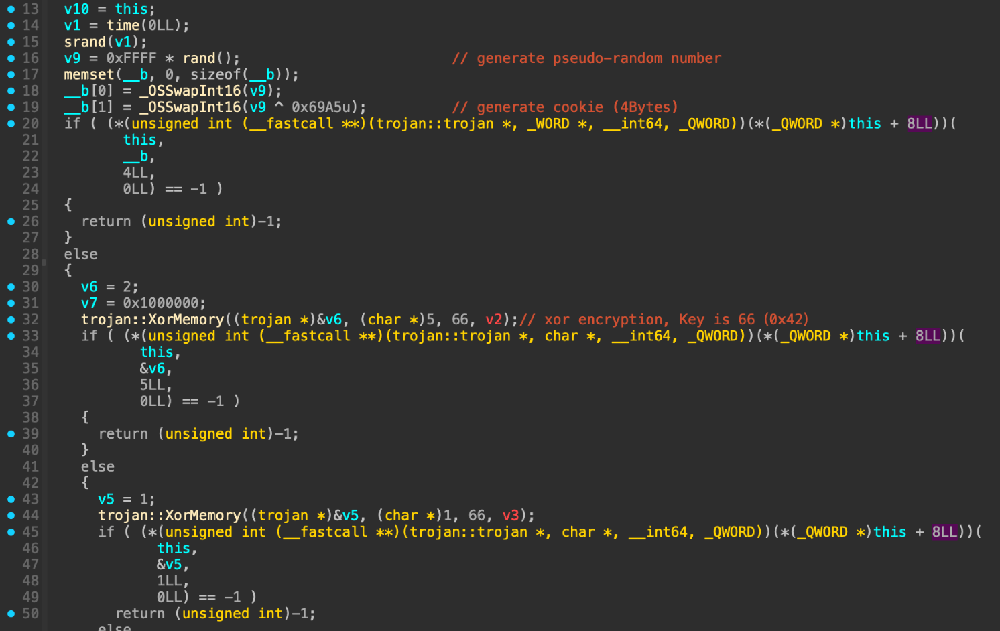
    - Generate a random number as a cookie.
	- Command data is encrypted using XOR, with the key being 0x42.

- Waiting for `interactive`

    - Receive Command
    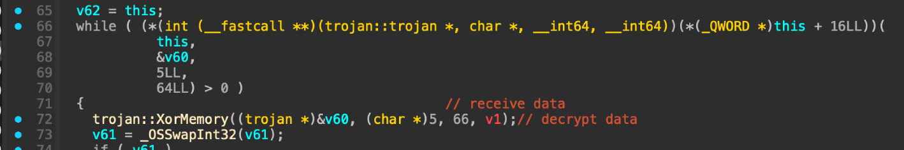

    - Code 3,8,9: `Execute command line`
    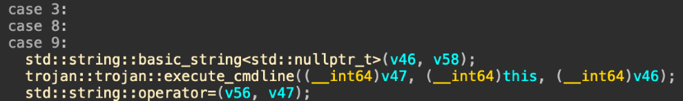

    - Code 4: `Write file`
    

    - Code 5: `Download file`
    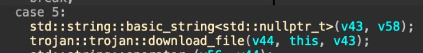

    - Code 11: `Ping check`
    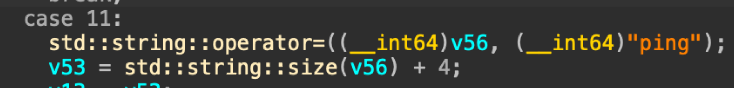

- Capture C&C Command
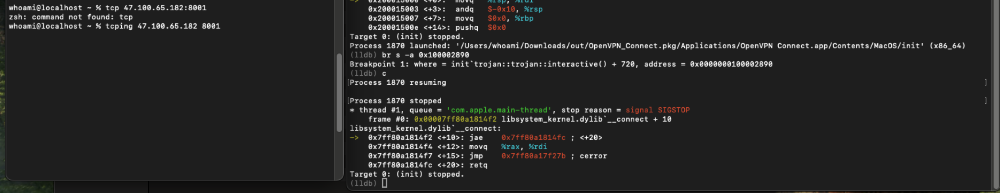
    The C&C Server was down.