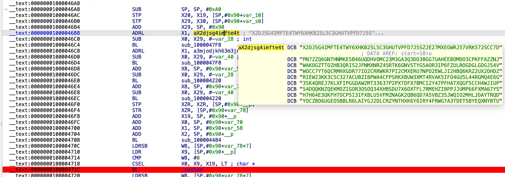
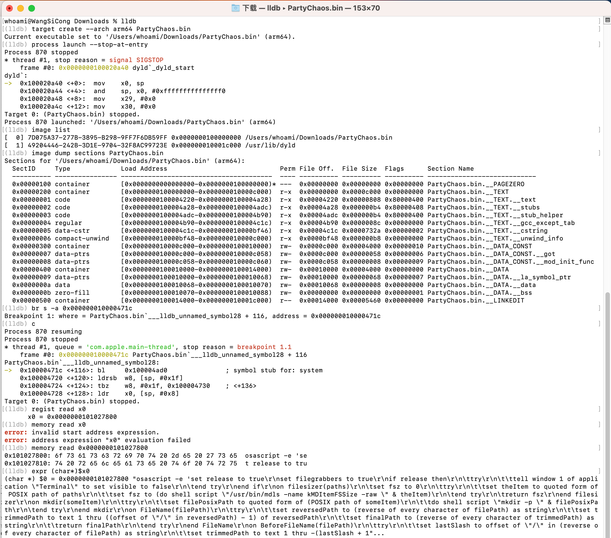

# PartyChaos(partychaos[.]space)
## Summary
- **Analysis Date**: 2024.11.8
- **Malware Sample**: From a phishing site: partychaos[.]space
- **Tag**: `Stealer`,`Cryptocurrency`,`Web3`

## Analysis

- In the entry function, you can see that after processing the variant string, use the system command to execute it

- Use lldb debugging to find the executed commands

## Threat Assessment

It tricked users into downloading and running it through a phishing website, thereby stealing local cookies, wallets, and other cryptocurrency-related data.